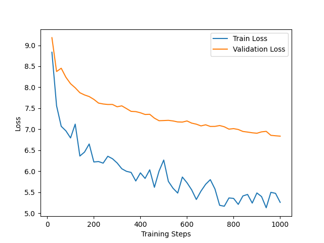

# Milestone 2 - Report

## Experimental Setup

My Generative Pretrained Model was trained on the SEC EDGAR 1993 corpus to establish a baseline for financial text generation.

### Architecture:
* 4 Layers
* 8 Attention Heads
* 256 Embedding Dimension
* 256 Context Window

### Tokenization:
* A custom regular-expression tokenizer generated a static vocabulary of 47,319 unique tokens.

### Optimization:
* Training was executed on an NVIDIA H100 GPU using PyTorch multiprocessing (8 workers), torch.compile, bfloat16 mixed precision, and TF32 matrix multiplications with a batch size of 256.

---

## Quantitative Metrics

The network was optimized using the AdamW algorithm against a cross-entropy loss function. Perplexity (PPL = exp(Loss)) was used to measure predictive uncertainty.

* **Final Training Loss:** 3.17
* **Final Training Perplexity:** 23.75
* **Final Validation Loss:** 3.85
* **Final Validation Perplexity:** 47.10

### Metric Analysis
A training perplexity of 23.75 demonstrates that the model successfully learned the statistical priors of the dataset, performing exponentially better than a uniform random distribution. However, the validation perplexity (47.10) is nearly double the training score. This significant generalization gap is a textbook empirical signature of overfitting, indicating the model is memorizing the training distribution rather than learning robust linguistic rules.

---

## Qualitative Evaluation

The model’s generative capability was evaluated using five domain-specific prompts paired with a deterministic (greedy) decoding algorithm.

* **Prompt 1:** The company has a
  * **Output:** number of patents and licenses, including patents, licenses, licenses, licenses and licenses, licenses...
* **Prompt 2:** Net income for the year was
  * **Output:** approximately $1. 5 million. The Company' s investment portfolio is managed by the Company' s investment portfolio...
* **Prompt 3:** The board of directors
  * **Output:** of the Company and its subsidiaries are subject to the supervision of the Board of Directors of the Board of Directors.
* **Prompt 4:** According to the financial statements,
  * **Output:** including the Company' s consolidated financial statements, and the Company' s consolidated financial statements...
* **Prompt 5:** Risk factors include
  * **Output:** the possibility of the possibility of the institution' s ability to meet the capital needs...

### Analysis
While the model accurately surfaces domain-specific vocabulary ("consolidated financial statements," "investment portfolio"), generation quickly deteriorates into repetition loops. Two architectural flaws drive this:
* **The Representation Bottleneck:** Forcing a highly sparse, unoptimized vocabulary of 47,319 tokens into a constrained 256-dimensional embedding space limits the model's ability to differentiate syntax, causing it to lose contextual mapping.
* **Greedy Decoding:** Always selecting the highest-probability token traps the self-attention mechanism in feedback loops (e.g., repeatedly generating "licenses" once its conditional probability spikes).

---

## Next Steps

To mitigate overfitting and generative degeneration, the following structural revisions will be implemented in the subsequent milestone:

* **Subword Tokenization (BPE):** Replace the custom regex tokenizer with OpenAI's tiktoken to aggressively condense the vocabulary and properly segment rare numerical strings into learnable subwords.
* **Network Regularization:** Increase the drop_rate (Dropout) within the Transformer blocks and apply Weight Decay (L2 regularization) in the AdamW optimizer to penalize memorization and enforce generalizable representations.
* **Stochastic Decoding Algorithms:** Upgrade the inference engine with Temperature Scaling and Nucleus (Top-K) sampling to introduce controlled entropy and break the greedy repetition loops.
